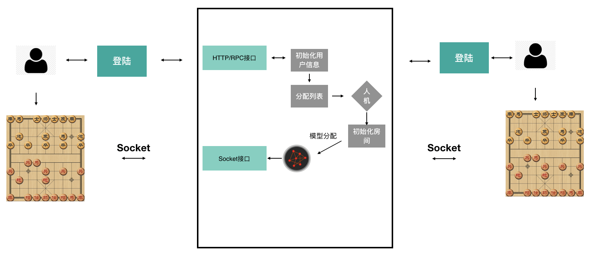
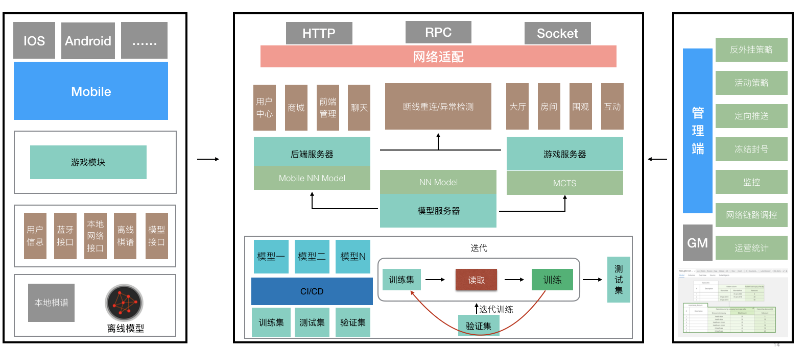
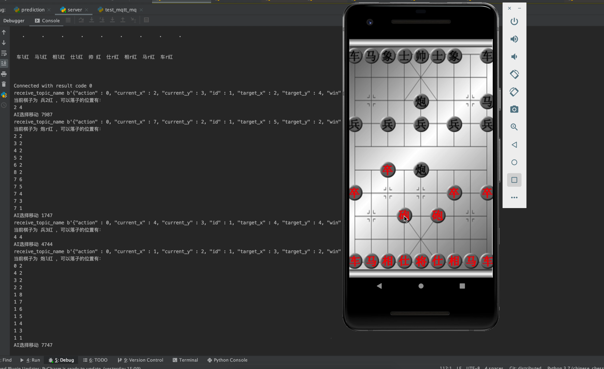
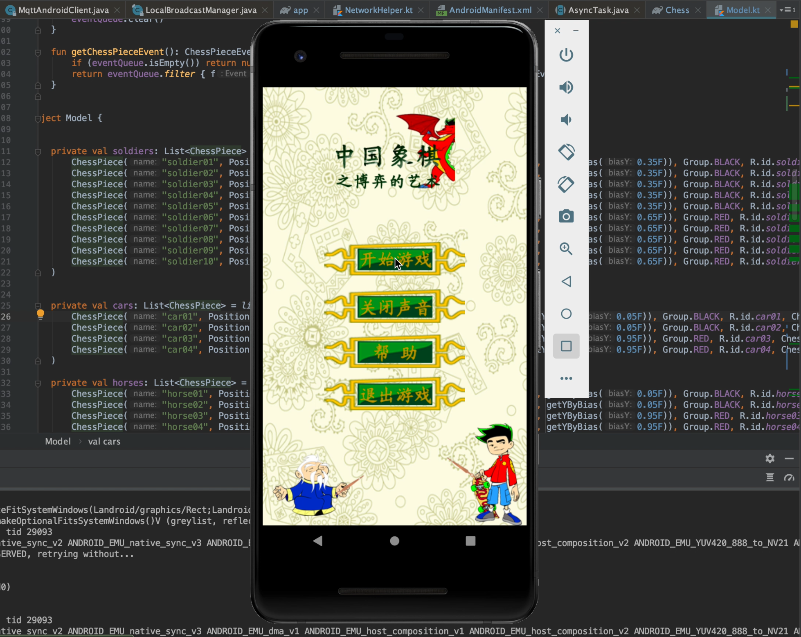
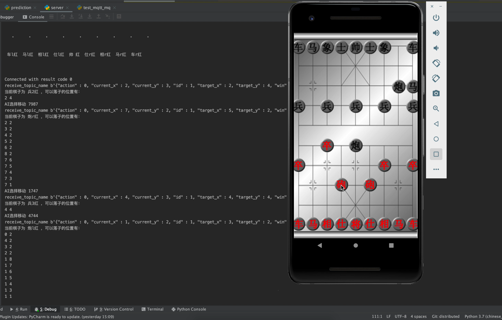

该项目fork [ChineseChess-AlphaZero](https://github.com/NeymarL/ChineseChess-AlphaZero)

ChineseChess-AlphaZero为象棋版的AlphaZero模型。

本项目基于以上模型代码做了扩展，主要是在工程领域的扩展，大概的工作如下：

* 使用Flask提供了一个HTTP服务，用来接收客户端的注册操作，针对每个用户后端使用一个独立的子进程初始化一个游戏服务器
* 新增模型预测调用接口，扩展了模型的服务
* 链接ActiveMQ消息队列，用来接收客户端发送的红棋操作
* 后端模型根据消息队列接收的操作，预测黑棋操作，并将消息发送至消息队列
* 用户中心，登陆注册
* Redis服务器保存游戏服务器

整体流程如下：

启动安卓APP后，会随机生成用户名和密码，发送服务器注册，服务器返回Token信息，APP拿着token进入房间，发送请求到服务器请求进入房间，后台根据token初始化单独的游戏房间，将信息保存在redis。
APP每次通过向消息队列发送消息，进行对弈。

整体架构如下：

本项目需要配合前端安卓端同时使用，安卓端链接：[点击](https://github.com/baifachuan/ChineseChess-Android)

准备工作：

* 提供一个ActiveMQ消息队列服务器
* 创建 `receive_topic_name` 和 `send_topic_name` topic
* 准备一个 `Redis` 服务器
* 修改 `network_helper.py` 中相关的服务器地址
* 运行 web下的 `web_server.py` 文件，启动服务器

使用步骤：

* 后端启动web_server.py服务器
* 启动安卓客户端，点击开始游戏，此时安卓端会发送注册消息，后端收到请求后会初始化服务，直到后端控制台输出：Connected with result code 0 后代表服务端初始化完成
* 此时可以点击安卓端进行下棋操作，后端会通过消息队列收到对应的操作，进行预测，在后端控制台可以看到接收到的下棋的步骤，以及可以行走的位置，来判断该操作是否合法
* 模型预测出AI下棋操作后会将消息发送至消息队列，后台会输出：AI 移动：XXXX 的操作
* 安卓端会修改UI，进行操作

目前来说仅仅是端到端调通了，因为模型和工程非常复杂，从模型调用到调试，以及安卓端的代码开发有非常多的操作，所以相对代码不是很细致。目前来说还有如下功能需要扩展：

* 断线重连
* 重复消息处理
* 消息乱序的情况
* 旁观

待后续继续扩展

注意：请注意修改消息队列的IP地址，ops下的mq.sh有使用docker启动的样例

